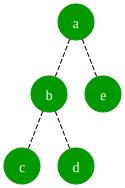
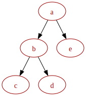
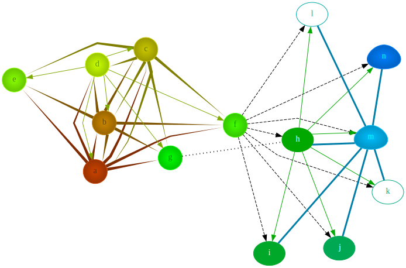
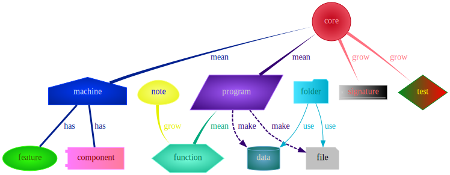
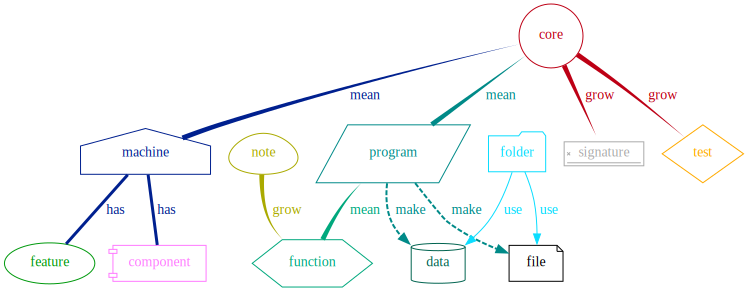
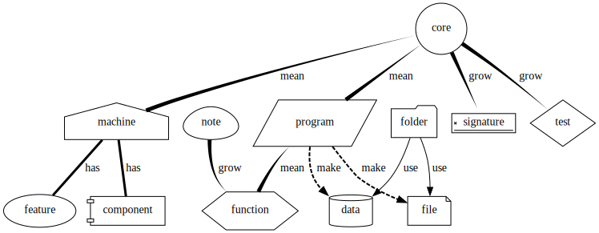

# Lsgv

**Lsgv: List Style Graphviz**

[Lsgv Illustration](https://github.com/chongwish/lsgv-illustration)

## Todo

- Support Cluster
- Parser Preprocessing
- Secondary Parser Symbol
- Customize Global Style

## Feature

### To present data as list

```scheme
(-> a b)
(-> (a b) c)
(-> a (b c (e f) d))
```

### Support style

```scheme
;; define style
($ red-style :color red)
;; use style
(+@ :type red-style a b)
```

### Style reuse

Different style for the data:

```bash
lsgv green-style.lsgvs diff-style-demo.lsgv
lsgv red-style.lsgvs diff-style-demo.lsgv
```




### User refine style

```scheme
(+@ :type my-node :color #x330099
    a b c d e)
```

### Dynamic calulate color

The node can calculate the color dynamically:

```scheme
(+@ :type rainbow
    h i j)
```

The color of line can be calculated dynamically:

```scheme
(-> :relation parent
    h (i j k l))
```



### Predefine a style for project

#### project style

```scheme
(+@ :type core
    core)
```



#### simple project style

```scheme
(+@ :type simple-core
    core)
```



#### override style

```bash
lsgv drop-color.lsgvs project-demo.lsgv
```



## Usage

### Format

```scheme
(instruction :key1 :value1 :key2 :value2
              data1 data2)
```

### Instruction

1. `!`: Settings
   - `:rankdir`: graphviz rankdir
   - `:layout`: graphviz layout
   - `:sep`: graphviz sep
   - `:splines`: graphviz splines
   - `:rainbow-color`: initial rainbow color
   - `:rainbow-count`: how many rainbow color
2. `$`: Style
3. `+@`: Node
   - `:color`: graphviz color
   - `:fontcolor`: graphviz fontcolor
   - `:style`: graphviz style
   - `:shape`: graphviz shape
   - `:type`: style
   - `:fontcolor-ratio`: the ratio of fontcolor
   - `:filled-color-ratio`: the ratio of filled color
   - `:color-ratio`: the ratio of color
   - `:fontcolor-offset`: the offset of fontcolor
   - `:filled-color-ratio`: the offset of filled color
   - `:fix-fontcolor-blue-offset`:the offset of blue
   - `:color-ratio`: the offset of color
   - `:override`: the method of color override
4. `=@`: Rank
5. `->`: Line
   - `:style`: graphviz style
   - `:arrowhead`: graphviz arrowhead
   - `:arrowtail`: graphviz arrowtail
   - `:penwidth`: graphviz penwidth
   - `:label`: graphviz label
   - `:color`: graphviz color
   - `:type`: style
   - `:relation`: dynamic calculate color

### Run

#### Environtment

1. Scheme Implementation (R7RS/R6RS)
2. Graphviz

The scheme implementation I use:

- Chez(R6RS)
- Cyclone(R7RS)

#### Script

```shell
# chez
scheme --script lsgv.scm $file
```

#### Binary

```shell
# cyclone
cyclone lsgv-with-r7rs.scm
lsgv-with-r7rs $file
```
